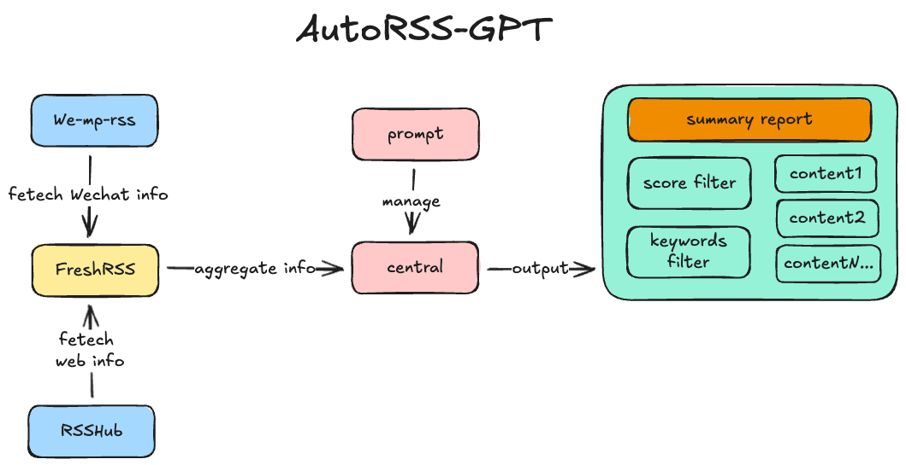

# AutoRSS: AI RSS Flow

简介

- 一个基于 Streamlit 的应用：从 FreshRSS 拉取文章，去重、用 LLM 分析并生成 JSON/Markdown 简报，提供仪表盘与历史归档；支持 Git 自动提交以便分发。



功能概览

- 运行分析：选择领域/提示词，拉取 RSS、去重、初筛、深度分析、全局总结；生成报告并保存到 data/reports。
- Dashboard：显示近况统计（抓取数量、去重后数量、通过数、历史报告数量、提示词领域数量等）与分布/趋势图。
- 历史报告：筛选与预览，支持导出/下载 Markdown；可保存为 .md 并自动写入 Git。
- 提示词与配置：管理 prompts.json；展示配置状态（优先 st.secrets，其次环境变量）；保存时可自动 git commit。


环境要求

- Python ≥ 3.11（推荐 3.11/3.12/3.13）。
- 已安装 pip 或 uv；可选 Docker。
- FreshRSS 实例与可用的 LLM API（示例为 SiliconFlow）。

安装与本地运行

1) 克隆并进入目录：

- `git clone https://github.com/mixiaoluo88/AutoRSS.git`
- `cd autorss`

2) 创建虚拟环境并安装依赖：

- `python -m venv .venv`
- `source .venv/bin/activate  # Windows 使用 .venv\Scripts\activate`
- `pip install -r requirements.txt`

3) 创建 secrets 文件：

- 复制示例：
  `cp .streamlit/secrets.example.toml .streamlit/secrets.toml`
- 填写真实配置：
  ```[freshrss]
  host = "http://localhost:8080"
  username = "your-user"
  password = "your-pass"
  [llm]
  base_url = "https://api.siliconflow.cn/v1"
  model = "Pro/deepseek-ai/DeepSeek-V3.2"
  api_key = "sk-..."
  [git]
  auto_commit = true
  auto_tag = false
  user_name = "Your Name"
  user_email = "you@example.com"

  ```

4) 启动：

- `streamlit run app.py`
- 浏览器访问 http://localhost:8501

页面说明

- 运行分析：选择领域后点击“立即运行”，完成后在页面展示元数据摘要并写入 data/reports/时间戳_领域.json。
- 历史报告：选择一个已保存报告，支持关键词筛选与分数过滤；可导出为 Markdown 或保存 .md 到仓库并自动提交。
- 提示词与配置：新增/编辑提示词；展示配置状态与示例 secrets；保存提示词时可自动 git commit。

配置来源与优先级

- 优先读取 .streamlit/secrets.toml（st.secrets），不存在时安全降级使用环境变量。

Docker 部署

1) 构建镜像：

- `docker build -t autorss .`

2) 运行容器（挂载 secrets 与数据）：

- `docker run -p 8501:8501 -v "$(pwd)/.streamlit:/app/.streamlit" -v "$(pwd)/data:/app/data" autorss`

3) 访问：

- http://localhost:8501

Git 集成

- .gitignore 已忽略 .streamlit/secrets.toml 与 .env；提交安全。
- 保存提示词或报告的 .md 时会调用 git 自动提交（可通过 secrets.git.auto_commit 控制）。
- 你可以在仓库根目录执行：
  - `git init && git branch -M main`
  - `git remote add origin [git@github.com:USERNAME/REPO.git](git@github.com:USERNAME/REPO.git)`
  - `git push -u origin main`

FreshRSS 连接提示

- 若在 Docker 中，确保 FreshRSS 与数据源（如 we-mp-rss）在同一网络或使用 host.docker.internal；URL 与端口请根据容器内监听端口配置。

常见问题

- 提示 StreamlitSecretNotFoundError：未创建 .streamlit/secrets.toml；按上文创建后重试。当前代码会在缺省 secrets 时降级到环境变量并在页面提示，不会崩溃。
- LLM 超时或配额限制：调整并发（secrets.concurrency）与节流策略，或降低分析范围（FETCH_MAX_COUNT/FETCH_DAYS）。

目录结构（简要）

- app.py（入口）
- pages/（多页：运行分析、历史报告、提示词与配置）
- services/（配置加载、Git 集成、存储工具）
- utils/（报告生成、UI 样式）
- data/（prompts.json、reports/*.json 与可选 .md）
- .streamlit/（config.toml 主题配置、secrets.toml 私密配置）
- Dockerfile、requirements.txt

许可证

- Apache-2.0 license
